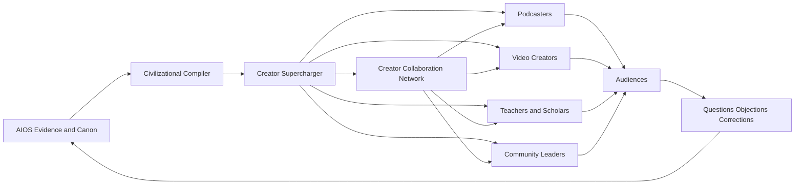

# Creator Supercharger Network

**Status:** Canonical working architecture  
**Purpose:** Turn the AIOS into distributed epistemic infrastructure for trusted creators, podcasters, educators, and public thinkers who already possess attention, trust, and cultural motion.

## Core thesis

One of the highest-leverage uses of the Digital House of Wisdom is not building an audience from zero.

It is **supercharging people who already have earned attention and trust**.

> **Do not merely become another creator. Build the intelligence layer that makes many good creators harder to mislead, harder to out-argue, and far more capable of teaching the truth.**

The creator is not a mouthpiece. The creator remains an independent thinker with a distinct voice, audience, moral judgment, and editorial freedom. The network supplies high-fidelity research, source maps, causal synthesis, public-language options, adversarial preparation, visual assets, correction support, and institutional memory.

## Strategic role in the larger architecture

- **Civilizational Memory OS:** evidence, canon, claims, corrections, and historical memory.
- **Civilizational Compiler:** turns evidence into judgment, narrative, teaching, and action.
- **Creator Supercharger Network:** routes the right compiled intelligence to the right trusted messenger.
- **Truth and Peace Engine:** production, distribution, experiments, and measurement.
- **Digital House of Wisdom:** the public institution and community that integrates them.

The Supercharger is the multiplier layer between intelligence and culture.

## The leverage inversion

The naive approach is:

`build content → chase attention → slowly earn trust → eventually teach`

The higher-leverage approach is:

`find existing trust → identify knowledge bottlenecks → equip the messenger → strengthen many downstream conversations at once`

This is not a replacement for building first-party media. It is the fastest path to distributed reach, diverse voices, and resilience against single-platform or single-person failure.

## The governing principle

> **Right truth. Right messenger. Right audience. Right moment. Right form.**

Raw reach is not the objective. A smaller creator with exceptional trust, topic fit, intellectual honesty, and audience relevance may have more marginal leverage than a much larger generalist account.

## Creator leverage model

A useful forcing function is:

`Expected leverage = (trusted reach × audience fit × topic relevance × adoption probability × asset readiness × transfer potential × recurrence × network effects) / (production cost × coordination cost × distortion risk × capture risk)`

This is not a literal universal equation. It prevents follower count from becoming the only variable.

### High-value creator attributes

- existing audience trust;
- willingness to correct mistakes;
- moral courage;
- demonstrated curiosity;
- ability to translate complexity;
- alignment with truth over faction;
- audience access the House of Wisdom does not yet possess;
- recurring formats where knowledge compounds;
- high likelihood of actually using supplied material;
- low probability of turning the system into tribal propaganda.

## The supercharge stack

### 1. Creator intelligence profile

A consent-based profile covering:

- topics and recurring questions;
- audience composition and knowledge level;
- preferred formats and voice;
- known positions and past claims;
- trusted source types;
- common adversaries and strongest objections;
- correction preferences;
- upcoming guests, episodes, debates, and opportunities;
- subjects where the creator wants deeper support.

The goal is personalization, not surveillance.

### 2. Episode and guest preparation room

Before a podcast, interview, debate, or video, the creator receives:

- one-page executive synthesis;
- claim-family map;
- source-layer map;
- strongest honest case for each side;
- load-bearing questions;
- likely traps and category errors;
- verified quotations and statistics;
- timeline and causal map;
- honest concessions;
- prohibited overclaims;
- memorable stories and analogies;
- follow-up reading and experts.

### 3. Rapid-response desk

When a narrative breaks:

- identify the durable claim family;
- separate the true fragment from the false totalizing map;
- issue a provisional evidence grade;
- generate an approved short response;
- provide source cards and visual evidence;
- flag what remains unresolved;
- update the packet as the evidence changes.

Speed must not silently outrun truth.

### 4. Debate and hostile-interview coach

The creator receives:

- strongest opponent formulation;
- likely rhetorical pivots;
- counterexamples;
- burden-of-proof challenges;
- clean definitions;
- source-layer corrections;
- retrieval lines;
- bridge language that lowers tribal defenses;
- stopping rules for unresolved claims.

The aim is not domination theater. It is clarity under pressure.

### 5. Story and clip forge

For each accepted claim:

- canonical verdict;
- public claim;
- legendary line;
- hook variants;
- short-form script;
- long-form outline;
- visual card;
- timeline or map;
- fair-context clip manifest;
- pinned-comment source stack;
- audience-specific variants;
- booster content.

### 6. Correction console

Trusted creators gain a fast, dignified way to correct public errors:

- exact correction;
- what changed;
- why the earlier claim failed;
- replacement model;
- source trail;
- audience-facing wording;
- update to the AIOS so the same failure becomes less likely everywhere.

A visible correction culture should increase trust rather than trigger reputational panic.

### 7. Creator memory

The system remembers:

- previous packets;
- unresolved questions;
- cited sources;
- public claims;
- corrections;
- audience objections;
- successful metaphors;
- recurring blind spots;
- which assets were actually used.

The creator should become cumulatively wiser rather than repeatedly starting from zero.

## The Creator Leverage Graph

The network should eventually be interactive and visual.

The visual system should show:

- creator nodes sized by trusted reach rather than raw followers;
- topic and audience-fit edges;
- audience overlap and uncovered communities;
- active narrative strains;
- available source-hardened assets;
- experts and creators capable of addressing each strain;
- marginal expected impact of the next packet;
- redundancy, bottlenecks, and single points of failure;
- feedback returning from audiences into research.

## Pareto deployment tiers

### Tier A — Founding supercharged creators

Three to five high-trust, high-fit creators receive concierge support. The manual loop proves value before software is built.

### Tier B — Creator guild

A small network receives shared research drops, episode rooms, private briefings, correction support, and collaboration opportunities.

### Tier C — Open creator commons

Public source cards, claim-family pages, downloadable visuals, scripts, and transparent evidence graphs are available to anyone.

The open layer creates reach. The trusted layer creates feedback quality. The founding layer proves the product.

## The first MVP

Do not begin with a giant platform.

Run a four-week concierge pilot with three to five creators.

For each creator:

1. build a lightweight intelligence profile;
2. select one upcoming episode, controversy, or recurring topic;
3. deliver one Creator Supercharge Packet;
4. offer a fifteen-minute preparation session;
5. track which parts were used;
6. collect objections and missing needs;
7. measure audience response and knowledge transfer;
8. update the packet, protocol, and AIOS.

The initial product can be a private GitHub-backed portal, secure document workspace, or simple web dashboard. Software should follow proven recurring use.

## Success metrics

Do not optimize primarily for impressions.

Measure:

- creator adoption rate;
- time saved;
- factual-error reduction;
- source use;
- correction speed;
- delayed audience recall;
- transfer to unseen examples;
- confidence calibration;
- cross-tribal acceptance;
- creator reuse of the same framework;
- audience questions that improve the AIOS;
- collaboration created between creators and experts;
- real institutions or actions triggered.

## Integrity and anti-capture rules

- creators retain editorial independence;
- no covert scripts or hidden coordination;
- sources and uncertainty remain visible;
- no payment for ideological conformity;
- no suppression of valid criticism;
- no creator receives a stronger claim than the evidence permits;
- audience profiling must remain consent-based and non-exploitative;
- the network must be able to correct founding creators publicly;
- creator popularity cannot override the canonical verdict;
- the AIOS cannot become a reputation-laundering service.

## Network effect

Every good creator question improves the Question Genome.

Every hostile interview improves adversarial preparation.

Every audience objection reveals a missing explanation.

Every correction improves trust and prevents repeated failure.

Every successful packet becomes a reusable module for the next creator.

> **The network compounds when helping one creator makes every future creator easier to help.**

## The deeper strategic insight

The Digital House of Wisdom should not seek to monopolize the voice of truth.

It should become the **intelligence infrastructure beneath a plural network of trustworthy voices**.

That is more scalable, more culturally adaptive, more resilient, and less vulnerable to institutional capture than a single centralized media personality.

## Canonical lines

> **Supercharge the messengers who already earned attention.**

> **The creator keeps the voice. The House of Wisdom strengthens the mind behind it.**

> **The highest-leverage media company may be the one audiences rarely see—the intelligence layer making every trusted creator better.**

> **Do not build one louder microphone. Upgrade the truth capacity of an entire network.**